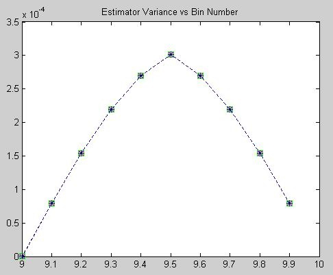
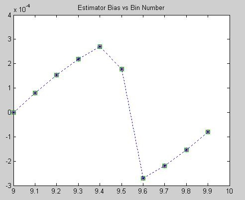
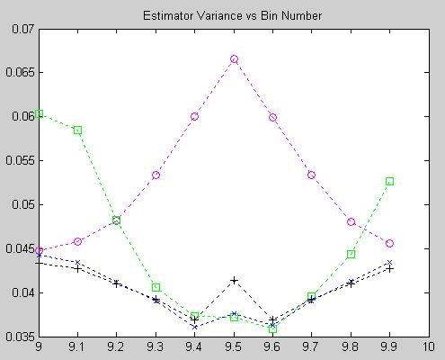
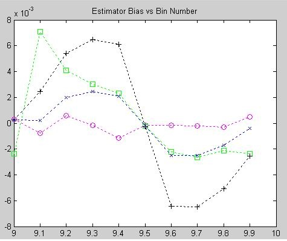
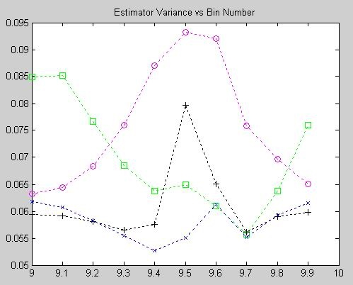
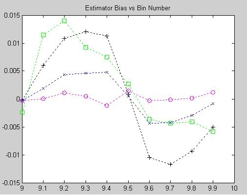
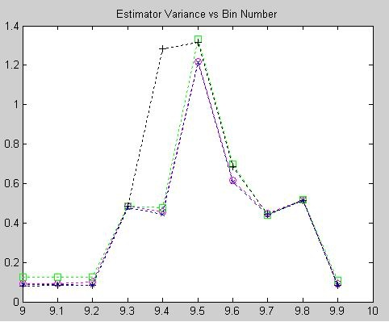
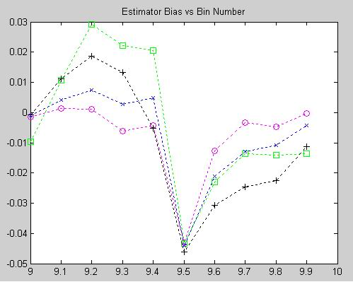

# Eric Jacobsen's Second Frequency Estimation Page

As I mentioned in my other Frequency Estimation Page, this topic comes up on comp.dsp periodically. More specifically, the topic of interpolating Fourier coefficients comes up at reasonably regular intervals and it has reared its ugly head yet again (June, 2002). In this case a discussion ensued about the relative performances and structures of the 3-coefficient estimator described on my previous FE page and Macleod's estimator, which contains a structure that is very similar.

Although the structures are very similar, when comparing Macleod's estimator and my quadratic estimator there are a couple of key differences. First a revelation on Macleod's relative to mine. The basic parts that we thought were similar during the newsgroup discussion were:

delta = Re[( X(k-1)-X(k+1))/((2*X(k))-X(k-1)-X(k+1))]

which is my entire estimator, and

d= Re( (X(k-1)-X(k+1) ) / Re (2 X(k)+X(k-1)+X(k+1))

delta = (sqrt(1+8d^2)-1)/4d

which was what we were presuming was Macleod's estimator, which looks like mine with an additional correction term. The first observation is that the signs of the adjacent bin terms in the denominators are opposite, which is a significant difference. Another observation is that Macleod's estimator as published in his paper [1] is really:

r = X(k)

R(n) = Re{ X(n) r\* }

i.e., create a real-valued vector R that is the Fourier coefficients times the conjugate of the maximizer. This presumably phase-aligns the terms relative to the peak so that Re() gets more meat.

Then

d = (R(k-1) - R(k+1))/(2\*R(k)+R(k-1)+R(k+1))

delta = (sqrt(1+8d^2)-1)/4d

So Macleod's estimator and mine are really quite different, but there are parts that look very similar.

In order to better understand the differences I went back to the Matlab code contained on Peter Kootsookos' Frequency Estimation Page and added characterizations of Macleod's estimator as well as Quinn's second estimator, which was not yet published when the original experiments were conducted. In this case I jointly simulated Quinn's first [2] and second [3] estimators, Macleod's estimator, and mine[4]. The simulator steps a tone from bin 9 to bin 9.9 in 0.1 bin steps and takes 10000 trials each using a 64-pt DFT. The estimates from each method are compared against the known tone frequency and the effects of DFT maximizer selection errors are included in the performance results to show system effectiveness. The mean (bias) and variance values of the results were collected and are displayed below, starting with the no-noize cases and working through increasing noise.

In all of the plots the estimators are represented as follows:

- Quinn's first estimator - Green squares.
- Quinn's second estimator - Black +.
- Macleod's estimator - Blue x.
- My Modified Quadratic Estimator (MQE)- Magenta circles.

|             Variance             |                Bias                |
| :------------------------------: | :--------------------------------: |
|  |  |

The above show the variance, (actually RMSE) and bias performance of each estimator with no added noise. In this case the estimators are indistinguishable and seem to exhibit consistent variance and bias performance. This seems a little odd on the surface and without further investigation speculate that there may be simulation artifacts that drive this joint performance behavior. In any case the relative performances are inseparable in this simulation.
While the plot legends indicate "variance" as the error statistic being displayed, the values shown are actually RMS error values.

|            Variance            |               Bias               |
| :----------------------------: | :------------------------------: |
|  |  |

The above show the RMSE and bias performance of each estimator with an SNR of +3dB. In this case Quinn's first estimator (squares) and the MQE (circles) exhibit RMSE performance consistent with what was seen in the previous experiments, with Quinn's exhibiting larger RMSE when delta is near zero (i.e., near the bin center) and the smallest variance near delta = 0.5. The MQE, in contrast, exhibits slightly better performance that Quinn's first near delta = 0, but peaks at delta = 0.5. Macleod's (x) and Quinn's (+) second exhibit very low variance with the exception of some peaking at delta = 0.5.
The bias performances are interesting, with Quinn's second exhibiting a significant sawtooth behavior. Macleod's follows the same pattern with smaller excursions. The MQE is notable in that it seems to have negligible bias independant of delta.

|            Variance             |               Bias                |
| :-----------------------------: | :-------------------------------: |
|  |  |

The above plots show the RMSE and bias performance of each estimator with an SNR of 0dB. The relative RMSE performances and patterns of the estimators is still generally intact, although the peaking at delta = 0.5 is increases for Quinn's second (+) and the MQE (o). The bias behaviors are also still generally the same as at +3dB, with the MQE still showing low, flat bias response and Quinn's still exhibiting a significant sawtooth excursion.

|        Variance (-3dB)         |           Bias (-3dB)            |
| :----------------------------: | :------------------------------: |
|  |  |

These plots show the RMSE and bias performance with an SNR of -3dB. Thesholding is beginning to occur for all estimators around delta = 0.5, and the relative RMSE values outside of that region are somewhat masked by the excursions due to thresholding. Quinn's second (+) arguably appears most susceptible to thresholding. The bias behavior is also exhibiting effects due to the thresholding, although the relative behaviors outside of the deviant region are still discernable.
In general it appears that Macleod's (x) and Quinn's second (+) estimators are very close in performance wrt RMSE and significantly better than the other two techniques. Bias behaviors are somewhat surprising with Quinn's second arguably the worst of the four and the MQE (o) consistently superior. It is notable that the bias values are consistently at minimum an order of magnitude smaller than RMSE quantities. In practical systems the bias behavior can sometimes be calibrated out, so selection of an estimator must be made in context with the application and the design constraints. An important consideraton in estimator selection is computational complexity. The MQE is generally simplest and requires only simple arithmetic and a single divide to compute. Macleod's offers excellent performance overall but requires divisions and a square root for the correction calculation. Quinn's second, also an excellent performer, requires several divides and natural logarithms. Quinn's first (square) is much simpler but still requires several divides.

## Matlab Code

Because it may be useful to someone, somewhere, I'm making the Matlab code available for public consumption below.

The usual disclaimers apply; read at your own risk, not responsible for items left lying about, don't try this at home, etc.

- [inttst3.m](https://github.com/kootsoop/frequency/blob/main/matlab/ericj2/inttst3.m) This is the main test routine and requires the following files.
- [macleod.m](https://github.com/kootsoop/frequency/blob/main/matlab/ericj2/macleod.m) This is the routine for Macleod's estimator.
- [quin.m](https://github.com/kootsoop/frequency/blob/main/matlab/ericj2/quin.m) This is the routine for Quinn's first estimator.
- [quin2.m](https://github.com/kootsoop/frequency/blob/main/matlab/ericj2/quin2.m) This is the routine for Quinn's second estimator.
- [quadterp.m](https://github.com/kootsoop/frequency/blob/main/matlab/ericj2/quadterp.m) This is the routine for my modified quadratic estimator.

## References

1.  Macleod, M.D., "Fast Nearly ML Estimation of the Parameters of Real or Complex Single Tones or Resolved Multiple Tones," IEEE Trans. Sig. Proc. Vol 46 No 1, January 1998, pp141-148.
2.  Quinn, BG, "Estimating frequency by interpolation using Fourier coefficients," IEEE Trans. Sig. Proc. Vol 42 No 5, May 1994, pp1264-1268.
3.  Quinn, BG, "Estimation of frequency, amplitude and phase from the DFT of a time series," IEEE Trans. Sig. Proc. Vol 45, No 3, Mar 1997, pp814-817.
4.  Jacobsen, E.A., "On Local Interpolation of DFT Outputs," web published, http://www.ericjacobsen.org/FTinterp.pdf, Fall, 1994 (est).

If you'd like, you can go [back to my home page.](http://www.ericjacobsen.org/) If not, don't.
